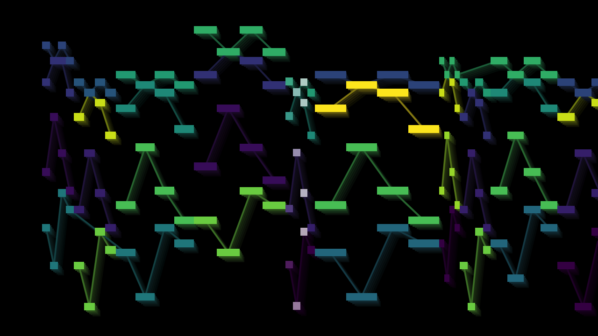

# Midani


Make piano-roll animations from midi files.



## Dependencies

Requires Python >= 3.8

- Python libraries:
    - opencv-python
    - mido
- Other:
    - R to plot frames
    - FFmpeg to add audio

## Installation

To install R and FFmpeg on MacOS with Homebrew:

```
brew install r
brew install ffmpeg
```

To install Python dependencies, from script directory:

```
pip install -r requirements.txt
```

To install the script itself, from the script directory:

```
pip install .
```

## Example Usage:

Create an animation with the default settings:

`midani --midi [MIDIFILE]`

The same, but add audio as well:

`midani --midi [MIDIFILE] --audio [AUDIOFILE]`

The same, but animate at 2fps rather than the default 30fps, so you can get a flavor of the results without waiting quite so long:

`midani --midi [MIDIFILE] --audio [AUDIOFILE] --test`

Create an animation using one of the sample settings and one of the sample midi/audio files:

`midani --settings sample_settings/settings1.py`

## Usage

```
usage: midani [-h] [-m MIDI] [-a AUDIO] [-s [SETTINGS ...]] [-t] [-e]
              [-f FRAMES]

Animate a midi file. The path to a midi file must either be included as a
command line argument with -m/--midi, or it must be specified with the
"midi_fname" keyword argument in a settings file provided with -s/--settings.

optional arguments:
  -h, --help            show this help message and exit
  -m MIDI, --midi MIDI  path to midi file to animate
  -a AUDIO, --audio AUDIO
                        path to audio file to add to video
  -s [SETTINGS ...], --settings [SETTINGS ...]
                        path to settings files, each containing a Python
                        dictionary
  -t, --test            set frame rate to a maximum of 2 fps
  -e, --eval            use 'eval()' rather than 'ast.literal_eval()' to parse
                        settings.
  -f FRAMES, --frames FRAMES
                        a comma-separated list of numbers (with no spaces);
                        specifies a list of individual frames to be drawn
```

## Configuration

For full documentation of the various settings available, and for how to set per-voice settings, see `docs/settings.md`.

To configure with custom settings, save one or more files, each containing only a python dictionary, and pass them as arguments with `-s`/`--settings`. (Usually, only one settings file is necessary, but you might want to use more than one if, for instance, you want to define a general style shared between several animations, but nevertheless tweak the settings for each individual midi file. When the same setting is found in multiple settings files, the setting in the last-listed file has precedence.)

For example, if you wanted a "primary color" note color palette, with white background color, you could save the following dictionary in a file called `example.py` and then invoke the script with `--settings example.py`:

```python
{
    "color_palette": (
        (255, 0, 0),
        (0, 255, 0),
        (0, 0, 255),
    ),
    "bg_colors": (
        (255, 255, 255),
    ),
}
```

For more examples, see the files in `sample_settings/`.

The settings files are ordinarily parsed with `ast.literal_eval()`, thus (to quote the Python docs) they "may only consist of the following Python literal structures: strings, bytes, numbers, tuples, lists, dicts, sets, booleans, and None." (If you get an error like `ValueError: malformed node or string`, then you are probably using expressions that `ast.literal_eval()` cannot parse.) If you wish to use conveniences like arithmetic expressions or list comprehensions, you can pass the `--eval` flag, and the settings files will instead be parsed with `eval()`. Don't do anything reckless with this! (E.g., use `--eval` with settings from sources that you do not trust.)

## Miscellany

Why, you might ask, is R used to plot frames, rather than a Python plotting library like Matplotlib? For no better reason than that at the time I started the script (in summer 2018), R was the only plotting software I was familiar with.

## Sample files

The subdirectory `sample_settings` contains a few sample settings files to quickly demonstrate a few of the different options available.

The subdirectory `sample_music` contains a few midi files to play with for demo purposes. I created these algorithmically with another project of mine. I have provided mp3s generated therefrom with `fluidsynth` and a free General MIDI soundfont. The audio fidelity may leave something to be desired.

## Known issues

[VLC](https://www.videolan.org/vlc/index.html) is recommended for playback of output video files. Videos also play back correctly on Youtube. But they don't always play back correctly with Quicktime:

- if framerate is too slow (e.g., with `--test` flag), there is no video playback (only a static green screen)
- audio playback doesn't seem to work.


## Major TODOs

- finish sample_settings
